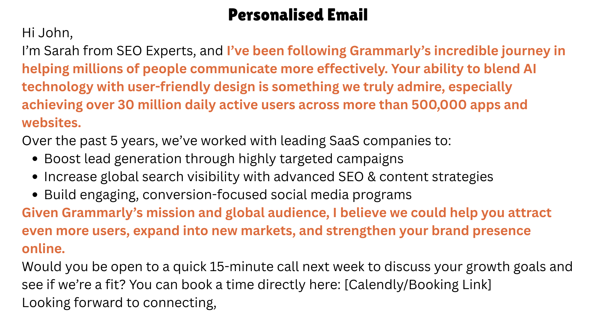

# AI-Powered Workflows: Transforming How We Work

_How artificial intelligence can revolutionizing productivity and workflows in your business_

## Introduction

Let's take a step back and try to understand workflows before AI (remember when Zapier became really popular?).
Workflows are a sequence of steps that need to be completed in order to complete a task (unlike agents which make their own next step). The task could be anything that is repetitive and can be broken into smaller steps. For example, creating an Excel sheet of leads from Facebook. This would involve a step tracking everyone who liked/commented on your post, or messaged you, looking at their profile, getting relevant information and filling out an Excel sheet. In the rest of this blog we will learn what has AI added
to these workflows.

<!-- more -->

## What Are AI Workflows?

They are very similar to the usual workflows, but certain steps are replace by an API call to any of the generative models like DallE for image generation or GPT 4.1 for text generation. These workflows can range from simple automation
(generating an image for Instagram post every Monday) to complex flows that combine human feedback (eg. after a demo that you just gave, the workflow goes through the transcript, searches/extracts information from the potential customers profile, prepares a draft email, sends you a Slack message about it, and updates the CRM).

## When do we use them?

AI workflows enable a lot of new use cases, think anything repetitive, needing personalization, doing research, generating images, text, audio, converting unstructured information to structured information, etc. For example, the image below is a template that can be used for outreach where the orange highlights are substituted for each lead. This is pretty common and is used in a lot of workflows; but with AI workflows you can make the AI do searches about the company, gather facts and then write a personalized email. In this case I asked it to write an email to the made up CEO (John Smith) of the company Grammarly.

## How do you create one?

Reach out to me! Or there are a number of workflow builders out there, some of them are more technical than others: n8n, Make, and more.
The basic pieces of the workflows are:

1. Scheduler: This could be a manual trigger or set to run at a certain frequency, for example, getting triggered every Monday and Friday.
2. Credentials: This could be in the form of API keys or usernames and passwords to connect your applications to perform a task, for example connecting to Slack, Gmail, Hubspot, OpenAI API and more.
3. Post processing: There is a need to clean up/ re-format the output generated by the AI to prepare it to be used for the next step.

## Let us see an example of a workflow for blog post creation

This was built for a SaaS company looking to reduce the workload on their marketing team. The solutions consists of two separate workflows, the first is a simple one which updates a Google sheet everyday with the published blog post titles from Wordpress, and the other workflow prepares the blog posts along with a corresponding image and saves the draft on Wordpress for human review. It alerts the person via a Slack message asking for a review. There is also a step after that to do SEO optimization (clean up the blog post to make it SEO friendly, add in metadata like the title, description and URL slug). The blog post creation process is explained in the diagram below:

## Key Benefits You Can Expect

When implemented correctly, AI workflows can deliver significant returns:

- **Time Savings**: Reduce manual work by 60-80% on repetitive tasks
- **Consistency**: Eliminate human error in routine processes
- **Scalability**: Handle increased workload without proportional staff increases
- **24/7 Operation**: Workflows run continuously, even outside business hours

## Getting Started: Your Next Steps

Ready to transform your business processes? Here's how to begin:

1. **Audit Your Current Processes**: Identify repetitive tasks that consume significant time
2. **Start Small**: Choose one simple workflow to pilot (like the blog post example above)
3. **Measure Results**: Track time saved and quality improvements
4. **Scale Gradually**: Expand to more complex workflows as you gain confidence

The businesses that embrace AI workflows now will have a significant competitive advantage as this technology becomes mainstream. Don't wait until your competitors are already ahead.

!!! note "Ready to Build Your First AI Workflow?"

    **I help businesses implement AI workflows that actually work.** From simple automation to complex multi-step processes, I can help you identify opportunities and build solutions that save time and increase efficiency.

    **Want to explore what's possible for your business?** [Book a consultation](https://calendar.app.google/Fp2CxLodVBhGARfG6) and let's discuss how AI workflows can transform your operations.

    **Prefer to stay updated?** [Sign up for my newsletter](https://www.sentick.com/signup) where I share real-world AI application examples and implementation strategies.
