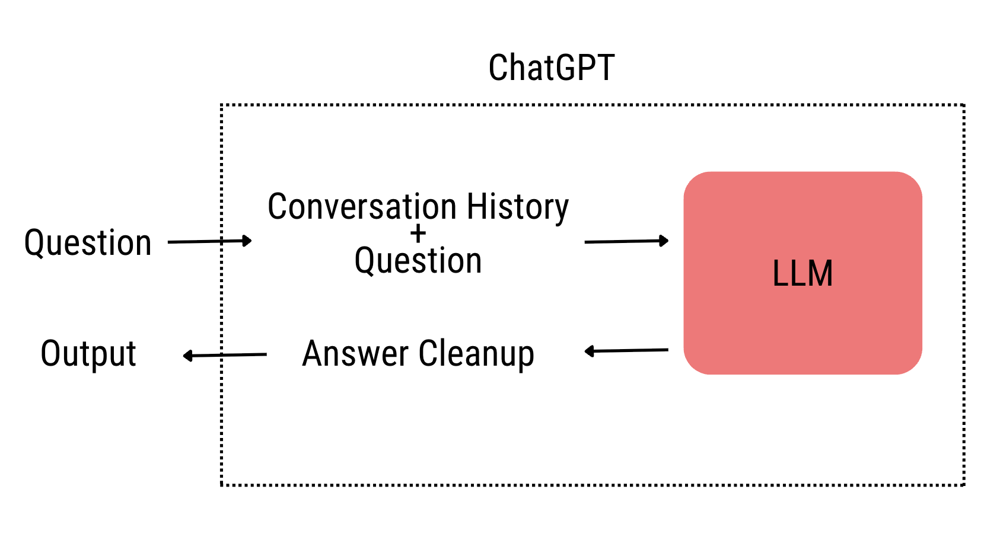
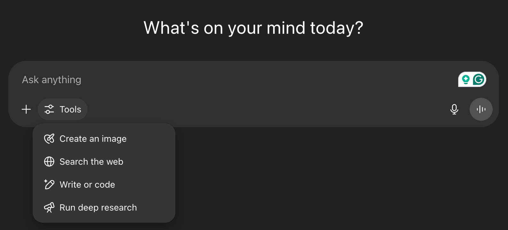
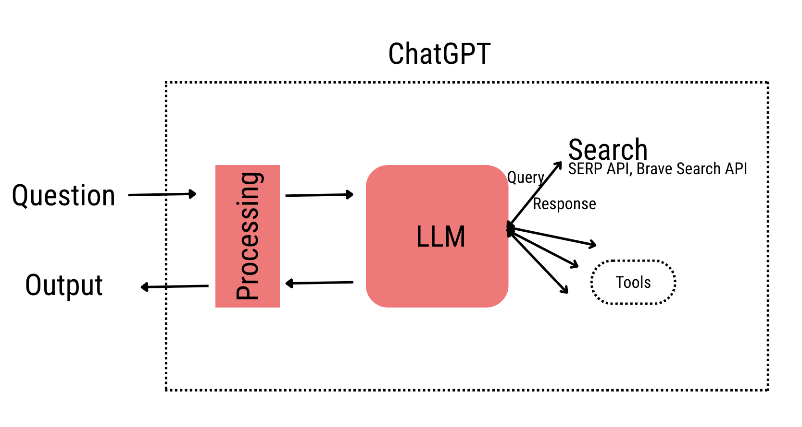

# SEO in the age of AI

<!-- Optional: Add an excerpt separator if you want a custom teaser on index pages -->

Recently, I was on a call with a business and they were worried about how do they get in front of people when search habits are changing so quickly. Basically, more people are doing their searches on AI products like ChatGPT and Perplexity instead of doing a typical Google search. They were concerned about not showing up on the ChatGPT answer when a potential customer asks a question about their industry; also known as GEO (Generative Engine Optimization).
In this blog, I will try to cover everything that I explained to them and any business should know at this time when people's search behavior is changing so drastically.

<!-- more -->

## How does search on AI products (ChatGPT...) work?

AI products have LLMs (Large Language Model trained on lots of data from the internet) behind it, when you ask a question, the question goes through a processing step where the historical conversation gets added along with the company's system prompt (Basically OpenAI giving context to the LLM, like the date today is this, user's name is...) and then sent to the LLM. Similarly, when the response is received from the LLM it goes through a processing step again to clean it up and then given to the user, see diagram below.

Okay, so the above was a simple explanation on what goes behind the scenes, but there is more to this. Below if a screenshot of the ChatGPT interface, the LLM has access to a number of tools that can be enabled by the user or it can decide to call. We will only be focusing on the "Search the web" tool.

If the search tool is enabled or the LLM decided search is necessary - this would happen only when it thinks the information from its internal knowledge base is outdated/not enough to answer the user query (remember LLMs are trained on pretty much all the data out there on the internet until a certain date, hence all the models have a knowledge cut off date). When it decides to do a search it can use search APIs like Brave search API, SERP API and more. Let's focus on the Brave Search API as it is publicly known to be used multiple AI product companies, [here](https://api-dashboard.search.brave.com/app/documentation/web-search/query) are the parameters that it expects for carrying out a search and here is the [response object](https://api-dashboard.search.brave.com/app/documentation/web-search/responses).

The important input parameters to think about are

- **q**: Query parameter that the LLM generates based on the user query to call the search tool
- **freshness**: Filters search results by when they were discovered. LLM can use it to prioritize recent pages or vice versa.
- **result_filter**: Available result filter types are discussions, faq, infobox, news, query, summarizer, videos, web, locations. If the LLM is using any filters while calling the search API it can significantly change the search results it sees.
- **count**: The number of search results returned in response, maximum is 20.

## What steps you need to take?

Okay, now that we understand what is happening behind the interface of these AI products. Let's see what changes for businesses.
The usual SEO stuff is still valid, finding the necessary keywords -> Generating content on them. But, also if your business needs to show up in the AI
products, you need to be where they look for while responding to a user query. For example, in the below video, I ran a deep research query for the industry that the business was trying to focus on,
the video is pretty long, but you can speed it up an watch. What is important are the queries that the LLM is creating (rabbit holes that it is trying to explore) and the sources that it is exploring.
In this particular run, we learned that it wasn't parsing the pricing correctly for them because of their page title, it was thinking their pricing feature is the same as their software pricing. The
other learning that they had was their website was only referenced twice even though it contained a lot of relevant information and the third thing was that they need to work on their social media presence like Linkedin, Reddit and more.

<iframe width="560" height="315" src="https://www.youtube.com/embed/wPHicPL_lzw?si=NASx2qWoY52oEmz4" title="YouTube video player" frameborder="0" allow="accelerometer; autoplay; clipboard-write; encrypted-media; gyroscope; picture-in-picture; web-share" referrerpolicy="strict-origin-when-cross-origin" allowfullscreen></iframe>

Again, what is important is understanding how these models work when responding to a user query. One piece is it utilising it's internal knowledge (data from the internet it was trained on)
and other is the information search that it carries out. You need to make sure to be present at every spot it explores.

Here are the list of things, in no particular order, that will help in making sure that you are providing data for the LLM training as well as making sure you show up in the retrieved results by the third party tool.

- Update your robots.txt to ensure GPT crawlers can access your site (this would make sure when a new model gets trained your website is in the training data).
- Add [llms.txt](https://llmstxt.org/) file to your website to provide LLM friendly content.
- Create alternatives/comparison content. Like "Airbnb vs Vrbo, which is better?"
- Think about every use case and feature of your product and have content about them. Like "X pricing forecasts", "X form parsing"
- Increase your presence in social media sites like Reddit, Linkedin, Quora and more.

!!! note "Let's Keep the Conversation Going"

    **Thanks for sticking with me until the end!** I'm passionate about helping businesses thrive amid change—if you'd like more hands-on tactics and real-world case studies, [sign up here](https://www.sentick.com/signup).

    **Need personalized guidance?** If you'd like to discuss how I can help your team, grab a slot on my [calendar](https://calendly.com/apurva-sentick/60min).
